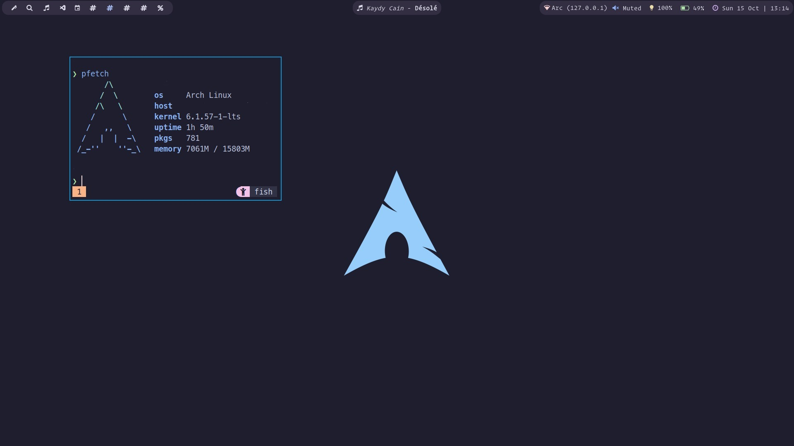
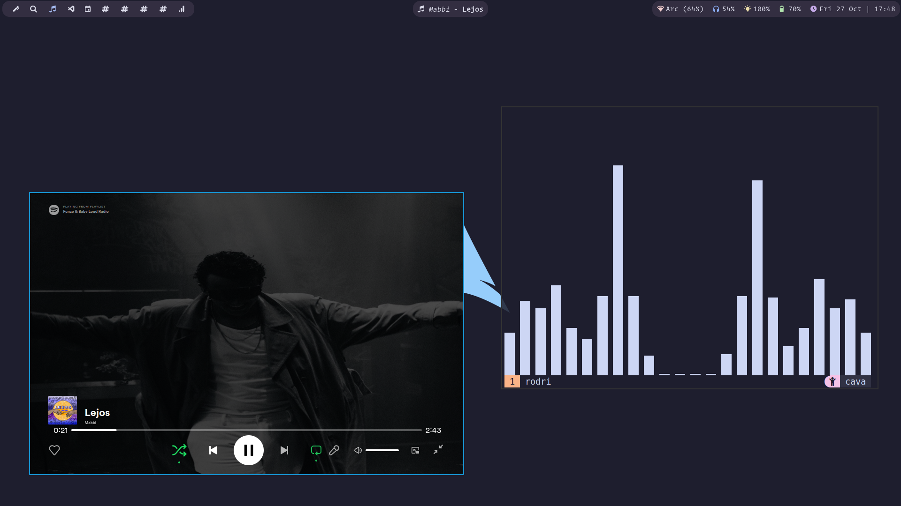
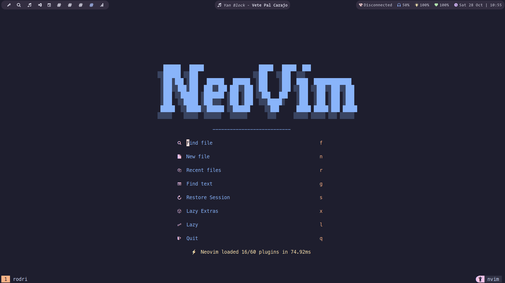
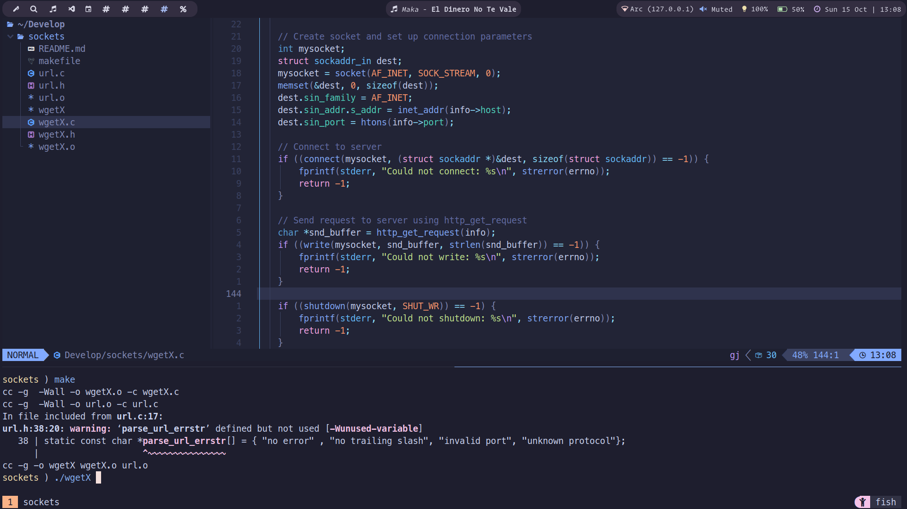

# Arch Linux Catppucin

## Base Look

## Music

## Nvim Base

## Nvim development

## Components:

- **OS**: [Arch Linux (Wayland)](https://archlinux.org/)
- **WM**: [Sway](https://swaywm.org/)
- **Shell**: [Fish](https://fishshell.com/)
- **Terminal**: [Alacritty](https://alacritty.org/)
- **Editor**: [Neovim (lazynvim)](https://neovim.io/)
- **File Manager**: [nnn](https://github.com/jarun/nnn)
- **Launcher**: bemenu
- **Emoji Picker**: wofi
- **Notification Daemon**: [Mako](https://github.com/emersion/mako)
- **Terminal Multiplexer**: [tmux](https://github.com/tmux/tmux)
- **Bar**: [Waybar](https://github.com/Alexays/Waybar)
- **Lockscreen**: swaylock with [Calvin and Hobbes Wallpaper](./Wallpapers/calvin-and-hobbes.png)
- **Music Visualizer**: [Cava](https://github.com/karlstav/cava)

