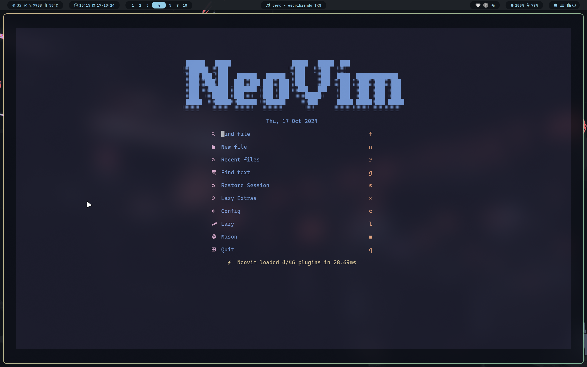

# Arch with Hyprland

Using [Hyprdots](https://github.com/prasanthrangan/hyprdots)

Added **custom** personalized keybindings, waybar modules and monitor settings.

# Base look


# Nvim



# Getting started

```bash
# First, setup Arch with Hyprdots
# Then:
## Hypr
mv ~/.config/hypr ~/.config/hypr.bak
cp -r hyprland/* ~/.config/hypr/

## Scripts
mkdir -p ~/scripts
cp -r scripts/* ~/scripts

## nvim
mkdir -p ~/.config/nvim
cp -r nvim/* ~/.config/nvim/

## Waybar
mv ~/.config/waybar ~/.config/waybar.bak
cp -r waybar/* ~/.config/waybar/
```